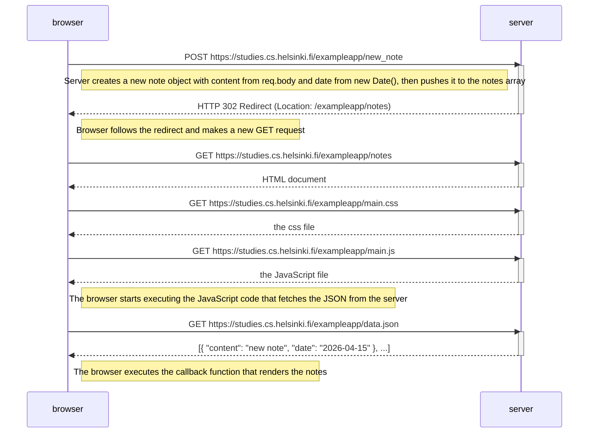

# 0.4: New note diagram

Sequence diagram depicting the situation where the user creates a new note on the page https://studies.cs.helsinki.fi/exampleapp/notes, by typing something into the text field and clicking the submit button.

